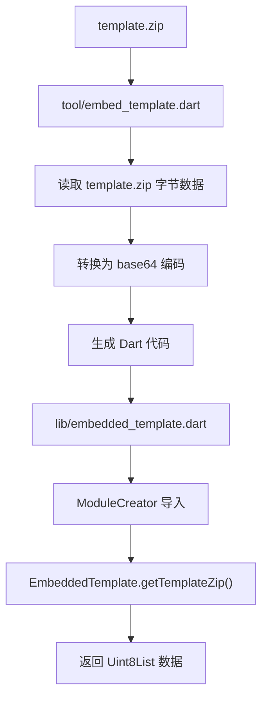
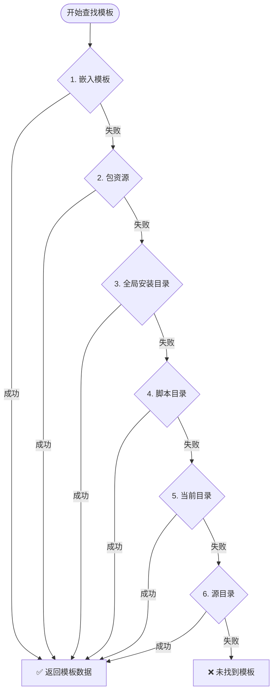
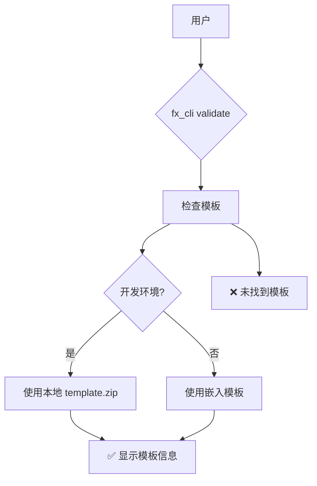

# 模板嵌入流程

## 概述

为了解决全局安装后无法找到 template.zip 文件的问题，我们将模板文件嵌入到可执行文件中。

## 嵌入流程



## 模板查找优先级



## 构建流程


## 使用场景



## 命令说明

### 嵌入模板
```bash
dart tool/embed_template.dart
```

### 清理缓存并重装
```bash
rmdir /s /q .dart_tool
dart pub get
dart pub global deactivate fx_cli
dart pub global activate --source path .
```

### 验证模板
```bash
fx_cli validate
```